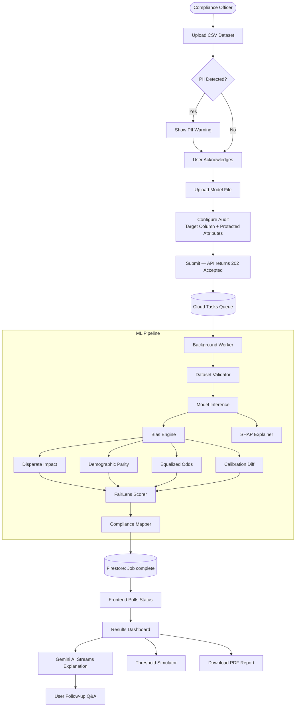
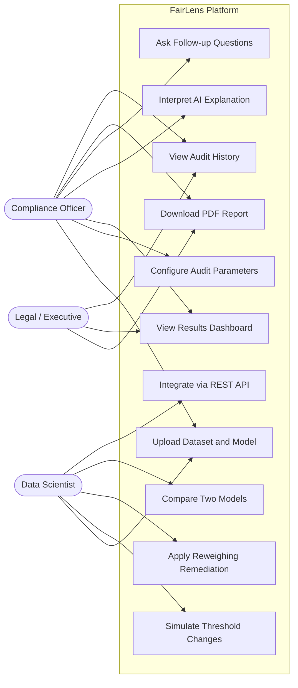
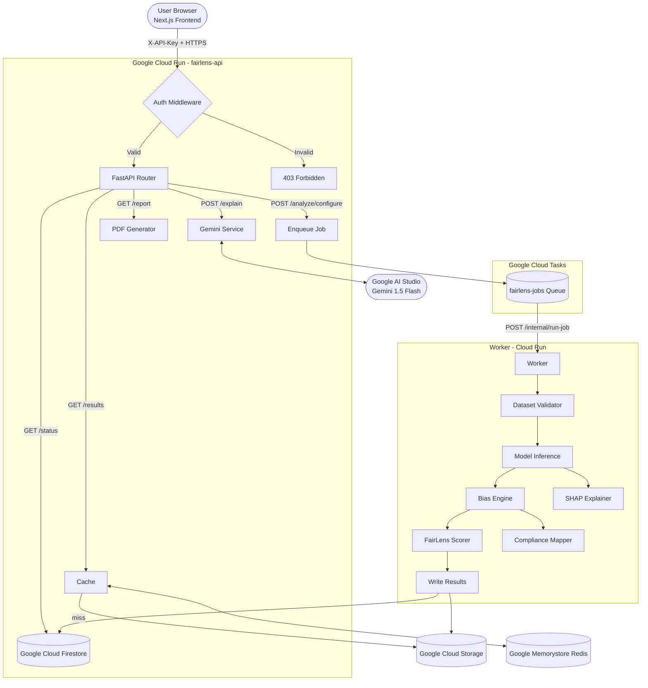

# FairLens — Project Proposal

---

## 1. Brief About the Project

**FairLens** is an AI-powered compliance platform that automatically audits machine learning models for algorithmic bias before they are deployed in production. It is designed for compliance officers, legal teams, HR departments, and product managers — not just data scientists.

A user uploads their dataset and trained model. FairLens runs a multi-metric fairness analysis across protected demographic attributes (race, gender, age, disability, etc.), produces a regulatory compliance report, streams a plain-English AI explanation powered by Google Gemini, and generates a downloadable PDF audit report that can be shared with regulators or leadership.

The platform is built on a cloud-native, asynchronous architecture using **Google Cloud Run**, **Cloud Tasks**, **Firestore**, and **Google AI Studio (Gemini 1.5 Flash)**, with a full local development mode that requires zero cloud infrastructure.

---

## 2. The Problem

### Algorithmic Bias is a Hidden, Systemic Risk

Modern organisations increasingly use AI models to make high-stakes decisions:

- **Hiring systems** that screen CVs and shortlist candidates
- **Credit scoring** systems that approve or deny loans
- **Criminal justice** tools (e.g., recidivism risk scores like COMPAS)
- **Healthcare** triage and resource allocation algorithms
- **Insurance** pricing and underwriting models

These systems can — and frequently do — discriminate against protected groups, not because they are explicitly programmed to, but because they learn patterns from historical data that already encodes human bias.

### The Regulatory Pressure is Accelerating

| Regulation | Jurisdiction | What it requires |
|---|---|---|
| **EU AI Act** | European Union | Mandatory bias audits for "high-risk" AI systems |
| **EEOC 80% Rule** | United States | Hiring selection rates cannot fall below 80% for any protected group |
| **Equal Credit Opportunity Act (ECOA)** | United States | Credit decisions cannot discriminate by race, gender, or age |
| **ISO/IEC 42001** | International | Calibration and reliability parity across demographic groups |

### The Current Gap

Despite the urgency, there is **no accessible, end-to-end tool** that allows a non-technical compliance officer to:
1. Upload a model and dataset
2. Instantly receive a measurable bias score
3. Understand what it means in plain English
4. Know exactly which laws are being violated
5. Export a compliance-grade PDF report

Data science teams rely on fragmented Python libraries (`aif360`, `fairlearn`) that require significant expertise and produce no business-ready outputs. Legal teams are left waiting weeks for reports.

---

## 3. How the Solution Works

FairLens provides a guided, six-stage workflow:

### Stage 1 — Upload Dataset
The user uploads a CSV file containing historical model predictions. FairLens validates the file (size, columns, missing data rate) and scans it for 13 categories of PII with a warning system.

### Stage 2 — Upload Model *(optional)*
The user optionally uploads their trained model (`.pkl` or `.onnx`). If uploaded, FairLens runs its own inference on every row. If omitted, FairLens uses predictions already present in the CSV.

### Stage 3 — Configure Audit
The user selects the **target column** (model output), **protected attributes** (demographic columns), and **decision threshold**.

### Stage 4 — Run Analysis
FairLens runs its bias engine asynchronously (via Google Cloud Tasks) to compute four fairness metrics across every protected attribute and group combination.

### Stage 5 — Review Results Dashboard
The user sees a full dashboard with: FairLens Score, metric breakdown, SHAP feature importance, regulatory compliance mapping, threshold simulator, and AI synthesis stream (Gemini) with follow-up Q&A.

### Stage 6 — Export Report
A PDF audit report is generated with a CONFIDENTIAL watermark, downloadable for regulators and leadership.

---

## 4. Opportunities in the Solution

| Opportunity | Detail |
|---|---|
| **Regulatory Compliance Market** | The EU AI Act applies to all organisations operating in the EU. Compliance consultancy is projected to be a multi-billion dollar market by 2027. |
| **Enterprise HR & Recruiting** | Every large organisation using an ATS is a potential customer. Hiring bias lawsuits cost an average of $2.5M per case. |
| **Financial Services** | Banks and lenders are already subject to ECOA and fair lending audits. FairLens automates what currently takes compliance teams months. |
| **Government & Public Sector** | Governments deploying predictive policing, welfare distribution, or court decision tools face growing public and legal scrutiny. |
| **API-as-a-Service** | Any existing platform (HR software, LoanOS, credit bureau) can integrate FairLens as a compliance middleware layer via the REST API. |
| **Audit Trail as a Product** | The tamper-evident chain-of-custody audit log is itself a compliance artifact that auditors and regulators require. |

---

## 5. How FairLens Differs From Existing Solutions

| Feature | FairLens | IBM AI Fairness 360 | Microsoft Fairlearn | Google What-If Tool |
|---|---|---|---|---|
| **No-code interface** | ✅ Full web UI | ❌ Python library | ❌ Python library | ⚠️ Limited notebook UI |
| **Designed for non-technical users** | ✅ Yes | ❌ Data scientists only | ❌ Data scientists only | ❌ Data scientists only |
| **Regulatory compliance mapping** | ✅ EU AI Act, EEOC, ECOA, ISO | ❌ None | ❌ None | ❌ None |
| **AI plain-English explanation** | ✅ Gemini streaming + Q&A | ❌ None | ❌ None | ❌ None |
| **PDF audit report** | ✅ Compliance-grade PDF | ❌ None | ❌ None | ❌ None |
| **API-first for integration** | ✅ REST API with auth | ❌ Library only | ❌ Library only | ❌ Notebook only |
| **Cloud-native & scalable** | ✅ Cloud Run + Cloud Tasks | ❌ Local only | ❌ Local only | ❌ Local only |
| **Audit log / chain of custody** | ✅ Tamper-evident log | ❌ None | ❌ None | ❌ None |
| **Remediation built-in** | ✅ Reweighing + threshold | ⚠️ Library functions | ⚠️ Library functions | ❌ None |

**Key Differentiator:** Existing tools are engineering tools that require a data scientist to write Python code. FairLens is a compliance product that a legal officer, HR manager, or board member can operate in under 5 minutes.

---

## 6. How FairLens Solves the Problem

### The Four Fairness Metrics

| Metric | Legal Threshold | Standard |
|---|---|---|
| **Disparate Impact** — ratio of positive prediction rates across groups | ≥ 0.80 | EEOC 80% Rule |
| **Demographic Parity Difference** — gap in positive prediction rates | ≤ 0.10 | EU AI Act Art. 10 |
| **Equalized Odds Difference** — gap in true/false positive rates | ≤ 0.10 | EU AI Act Art. 13 |
| **Calibration Difference** — gap in prediction reliability (precision) | ≤ 0.10 | ISO/IEC 42001 |

### The FairLens Score
All four metrics are combined into a 0–100 score. Each metric is penalised proportionally by how far it falls from its legal threshold. The score maps to a grade (A–F) with a severity level (None / Low / Medium / High / Critical).

### Remediation
- **Threshold Simulator:** Real-time drag to see how changing the decision threshold shifts all fairness metrics.
- **Reweighing:** Applies a pre-processing technique that re-balances sample weights to reduce demographic parity — without retraining the model.

---

## 7. Unique Selling Propositions (USPs)

1. **Zero technical expertise required.** A compliance officer with no coding background can complete a full audit in under 5 minutes.
2. **Regulation-mapped results.** Every failed metric is directly linked to the specific clause in EU AI Act, EEOC, ECOA, or ISO/IEC 42001 that it violates.
3. **AI-powered plain-English explanation.** Google Gemini streams a narrative explanation and answers follow-up questions in natural language.
4. **Compliance-grade output.** The PDF report includes a CONFIDENTIAL watermark, chain-of-custody audit log, and regulatory references — ready to hand to a regulator or board.
5. **Cloud-scale architecture.** Built for concurrent enterprise-grade audits via async job processing, distributed state, and caching.
6. **API-first design.** Any enterprise platform can embed FairLens as compliance middleware via a single authenticated REST API.

---

## 8. Features

### Core Audit
- CSV dataset upload with validation (max 200 MB, 2M rows, 500 columns)
- Model file upload (`.pkl` / `.onnx`) with automatic inference
- PII detection across 13 data categories with pre-analysis warning
- Four fairness metric computation
- FairLens Score (0–100) with grade and severity classification

### Results & Insights
- Interactive results dashboard
- SHAP feature importance visualisation
- Regulatory compliance mapping table
- Threshold simulator with real-time recalculation
- Reweighing remediation with before/after comparison
- Individual prediction explainer

### AI Features
- Google Gemini streaming explanation (Server-Sent Events)
- Structured key findings with headlines and detail
- Natural language follow-up Q&A on audit results

### Reporting & Compliance
- PDF audit report generation
- CONFIDENTIAL diagonal watermark on every page
- Tamper-evident JSON-lines audit log per job
- Chain-of-custody event tracking

### History & Comparison
- Persistent audit history with fairness score trend chart
- Side-by-side model comparison (baseline vs. remediated)

### Security & Infrastructure
- `X-API-Key` authentication (HMAC, timing-attack resistant)
- IP-based rate limiting (200 req/min per IP)
- Async job processing (Cloud Tasks with local fallback)
- Distributed state (Firestore with in-memory fallback)
- Result caching (Redis with in-memory fallback)

---

## 9. Process Flow Diagram



---

## 10. Use-Case Diagram



---

## 11. Wireframes / Mock UI Diagrams

### Homepage

```
+-----------------------------------------------------------------+
|  FairLens          How It Works    History    Compare   [Sun]   |
+-----------------------------------------------------------------+
|                                                                 |
|  +-----------------------------------------------------------+  |
|  |  AI Fairness Auditing for the Regulated Enterprise        |  |
|  |  Upload your model. Get a compliance report in minutes.   |  |
|  |                                                           |  |
|  |  [ Start New Audit ]        [ Try COMPAS Demo ]           |  |
|  +-----------------------------------------------------------+  |
|                                                                 |
|  +------------------------+  +------------------------------+   |
|  |  Recent Audits         |  |  How It Works                |   |
|  |  loan_model.pkl  ●     |  |  01 Upload CSV               |   |
|  |  compas_v2.pkl   ●     |  |  02 Upload Model             |   |
|  |  hiring_v3.pkl   OK    |  |  03 Configure Audit          |   |
|  |                        |  |  04 Review Results           |   |
|  |  [ View All History ]  |  |  05 Export Report            |   |
|  +------------------------+  +------------------------------+   |
+-----------------------------------------------------------------+
```

### Results Dashboard

```
+-----------------------------------------------------------------+
|  Fairness Audit Report              Severity: HIGH              |
|  loan_approval_model.pkl            FairLens Score: 61   D      |
+-----------------------------------------------------------------+
|  Target: loan_approved  |  Protected: race, gender  |  [ PDF ]  |
+-----------------------------------------------------------------+
|                                                                 |
|  AI Synthesis (Gemini)                                          |
|  +-----------------------------------------------------------+  |
|  | The model shows significant racial bias in loan approvals.|  |
|  | Black applicants are approved at 62% the rate of White    |  |
|  | applicants, violating the EEOC 80% Rule...                |  |
|  |                                                           |  |
|  | Ask FairLens: [_______________________________] [ Send ]  |  |
|  +-----------------------------------------------------------+  |
|                                                                 |
|  +---------------------+  +---------------------+               |
|  | Disparate Impact    |  | Demographic Parity  |               |
|  | 0.62    FAIL        |  | 0.18    FAIL        |               |
|  | Threshold: >= 0.80  |  | Threshold: <= 0.10  |               |
|  +---------------------+  +---------------------+               |
|  +---------------------+  +---------------------+               |
|  | Equalized Odds      |  | Calibration Diff    |               |
|  | 0.09    PASS        |  | 0.04    PASS        |               |
|  | Threshold: <= 0.10  |  | Threshold: <= 0.10  |               |
|  +---------------------+  +---------------------+               |
|                                                                 |
|  Threshold Simulator ----------------O----------- 0.50          |
|  SHAP Feature Importance [ Bar Chart ]                          |
|  Secure Audit Log [ Table ]                                     |
+-----------------------------------------------------------------+
```

### Upload Wizard

```
+-----------------------------------------------------------------+
|  Step 1 of 3 — Upload Dataset                                   |
|  [============================-----------------]  33%           |
+-----------------------------------------------------------------+
|                                                                 |
|  +-----------------------------------------------------------+  |
|  |                                                           |  |
|  |      Drag & Drop your CSV file here                       |  |
|  |           or  [ Browse Files ]                            |  |
|  |                                                           |  |
|  |      Max 200 MB   Max 2M rows   Max 500 columns           |  |
|  +-----------------------------------------------------------+  |
|                                                                 |
|  ! PII Warning Detected                                         |
|  +-----------------------------------------------------------+  |
|  |  Columns matching personal data:                          |  |
|  |  - ssn  =>  Social Security Number                        |  |
|  |  - dob  =>  Date of Birth                                 |  |
|  |                             [ I Understand, Continue ]    |  |
|  +-----------------------------------------------------------+  |
|                                                                 |
|                    [ Back ]   [ Next: Upload Model ]           |
+-----------------------------------------------------------------+
```

---

## 12. Architecture Diagram



---

## 13. Technologies Used

### Frontend
| Technology | Purpose |
|---|---|
| **Next.js 14** | React framework with App Router |
| **TypeScript** | Type-safe development |
| **Tailwind CSS** | Utility-first styling |
| **Recharts** | Score trend charts |
| **Lucide React** | Icon system |

### Backend
| Technology | Purpose |
|---|---|
| **FastAPI** | High-performance async Python API |
| **Scikit-learn / ONNX Runtime** | Model inference |
| **SHAP** | Feature importance computation |
| **WeasyPrint** | PDF report generation |
| **SlowAPI** | Rate limiting middleware |
| **Pytest** | Unit testing |

### Google Cloud Services
| Service | Purpose |
|---|---|
| **Google Cloud Run** | Serverless container hosting |
| **Google Cloud Tasks** | Async job queue for ML pipeline |
| **Google Cloud Firestore** | Distributed job metadata and status |
| **Google Cloud Memorystore (Redis)** | Results caching |
| **Google Cloud Storage** | File storage (CSV, models, PDFs) |
| **Google AI Studio (Gemini 1.5 Flash)** | Streaming AI explanation and Q&A |
| **Google Artifact Registry** | Docker image storage |
| **Google Cloud Build** | CI/CD for container builds |

### Deployment
| Tool | Purpose |
|---|---|
| **Docker** | Container packaging |
| **Vercel** | Frontend hosting |
| **gcloud CLI** | Backend deployment |

---

## 14. Estimated Implementation Cost

Based on Google Cloud published pricing at ~500 audits/month:

| Service | Monthly Estimate |
|---|---|
| **Cloud Run** (API + Worker) | ~$5–$15 *(scales to zero when idle)* |
| **Cloud Tasks** | ~$0 *(free tier covers 500 tasks easily)* |
| **Firestore** | **$0** *(free tier: 1M reads + 1M writes/day)* |
| **Cloud Storage** | ~$2 for 100 GB of uploads |
| **Cloud Memorystore (Redis 1 GB)** | ~$35/month |
| **Gemini 1.5 Flash** | **$0** *(free tier, no-billing project)* |
| **Cloud Build** | **$0** *(free tier: 120 build-minutes/day)* |
| **Vercel Frontend** | **$0** *(Hobby plan)* |
| **Total** | **~$40–$55/month** |

> For a hackathon or prototype, GCP credits and Vercel's free tier bring effective cost to **$0**.

---

## 15. Future Development

### Short-Term (0–3 Months)
- **Scheduled Audits:** Automatically re-run audits weekly/monthly and alert on fairness score degradation (model drift detection).
- **Team Workspaces:** Multi-user accounts for organisations to manage models, share reports, and assign reviewers.
- **Slack / Email Alerts:** Push notifications when a bias threshold is breached.
- **More Model Formats:** TensorFlow SavedModel, PyTorch `.pt`, XGBoost `.json`.

### Medium-Term (3–12 Months)
- **Direct Database Connectors:** Pull production prediction logs from BigQuery, Snowflake, or PostgreSQL — no CSV upload required.
- **Continuous Monitoring:** A lightweight SDK that wraps production inference and streams live data to FairLens for real-time monitoring.
- **Certification Badge:** A verifiable FairLens Compliance Certificate with public URL, embeddable in model cards and documentation.
- **Gemini-powered Remediation Plans:** Step-by-step guidance on feature engineering, data collection, or architecture changes.

### Long-Term (12+ Months)
- **Regulator Portal:** A read-only view where a government auditor can access an organisation's audit history without credentials.
- **Industry Benchmarks Marketplace:** Pre-built fairness benchmarks for mortgage lending, hiring, and healthcare so organisations compare against sector standards.
- **MLOps Platform Plugins:** Native integrations for MLflow, Vertex AI, and SageMaker to run FairLens automatically as a deployment gate — blocking models that fail fairness checks from reaching production.
