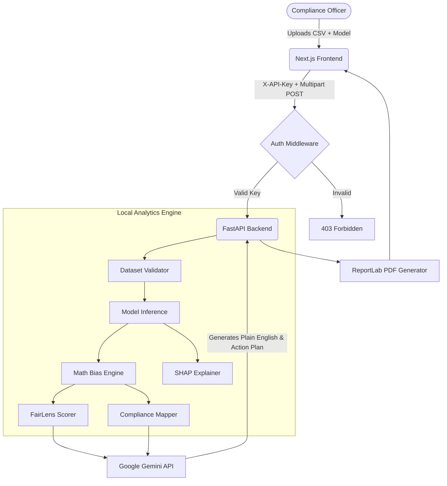

<div align="center">
  <h1>🔍 FairLens</h1>
  <p><strong>The compliance layer for Machine Learning models.</strong></p>
  <p>Every model that goes to production today is one bad prediction away from a lawsuit, a headline, and a regulator. FairLens catches discriminatory biases in 60 seconds.</p>
</div>

<br />

FairLens is an industry-grade ML auditing platform designed to detect bias, measure severity, and dynamically generate remediation action plans so your data science team can safely ship compliant models.

---

## 🌟 Key Features

* **Instant Bias Auditing** — Upload your dataset and model; FairLens calculates Disparate Impact, Demographic Parity, Equalized Odds, and Calibration Difference in one pipeline run.
* **FairLens Score** — A unified 0–100 score summarizing the ethical posture of the model, understandable for non-technical leadership.
* **Regulatory Compliance Mapping** — Automatically maps failed metrics to legal frameworks: **EU AI Act**, **US EEOC 80% Rule**, and **ECOA**.
* **Individual Prediction Explainer** — Enter a single row of data to see exactly why a protected applicant was accepted/denied, with SHAP waterfalls and automated counterfactual testing.
* **Side-by-Side Model Comparison** — Compare a baseline model against a remediated model to quantify fairness improvements.
* **Conversational AI Analysis** — Powered by Google Gemini; plain-English insight into bias causes with a 5-step concrete remediation plan.
* **Audit History** — Browse, filter, and compare all previous audits in a persistent dashboard view.
* **PDF Audit Reports** — Exportable compliance-grade PDF with metrics, charts, compliance tables, and AI summary.
* **PII Detection Warning** — Automatically scans uploaded CSV columns for personal data (emails, SSNs, names, phone numbers) and displays a visible warning banner before analysis begins.
* **Confidential PDF Watermark** — Every generated audit report is stamped with a diagonal `CONFIDENTIAL` watermark on all pages.
* **Secure Audit Log** — Every action on an audit job (upload, explain, download) is logged in a tamper-evident chain-of-custody panel visible on the results dashboard.
* **API Security** — All analysis endpoints protected with `X-API-Key` authentication and IP-based rate limiting.

---

## 🏗️ Architecture



---

## 🚀 How to Run Locally

You do not need an active Google Cloud Platform (GCP) project to test FairLens locally.

### 1. Start the Backend (FastAPI)

```bash
cd backend

# Create and activate virtual environment
python -m venv venv
# Windows:
venv\Scripts\activate
# Mac/Linux:
source venv/bin/activate

# Install dependencies
pip install -r requirements.txt
pip install -r requirements-dev.txt   # For running tests

# Configure environment
copy .env.example .env                # Windows
# Edit .env — set SECRET_API_KEY and GEMINI_API_KEY at minimum

# Start the API
uvicorn main:app --reload --port 8000
```

The API is now running at `http://localhost:8000` with interactive docs at [`/docs`](http://localhost:8000/docs).

### 2. Start the Frontend (Next.js)

Open a new terminal:

```bash
cd frontend
npm install

# Configure environment
copy .env.local.example .env.local    # Windows
# Edit .env.local — set NEXT_PUBLIC_API_KEY to match backend SECRET_API_KEY

npm run dev
```

The dashboard is now live at [`http://localhost:3000`](http://localhost:3000).

---

## ⚙️ Environment Variables

### Backend (`backend/.env`)

| Variable | Required | Description |
|---|---|---|
| `SECRET_API_KEY` | **Yes** | Shared secret for API authentication. Generate with: `python -c "import secrets; print(secrets.token_hex(32))"` |
| `GEMINI_API_KEY` | **Yes** | Google AI Studio key — free at [aistudio.google.com](https://aistudio.google.com/apikey) |
| `USE_LOCAL_STORAGE` | Yes | `true` = local disk (default); `false` = GCS |
| `FRONTEND_URL` | Yes | Your frontend domain for CORS. E.g. `https://your-app.vercel.app` |
| `USE_MOCK_PIPELINE` | No | `true` = skip real ML, use mock data (for frontend dev) |
| `LOCAL_UPLOAD_DIR` | Local only | `./storage_local/uploads` |
| `LOCAL_RESULTS_DIR` | Local only | `./storage_local/results` |
| `GCP_PROJECT_ID` | Production | Your GCP project ID |
| `GCS_UPLOAD_BUCKET` | Production | GCS bucket for uploads |
| `GCS_RESULTS_BUCKET` | Production | GCS bucket for results |

### Frontend (`frontend/.env.local`)

| Variable | Description |
|---|---|
| `NEXT_PUBLIC_API_URL` | Backend base URL. Default: `http://localhost:8000/api/v1` |
| `NEXT_PUBLIC_API_KEY` | Must exactly match `SECRET_API_KEY` in backend |
| `NEXT_PUBLIC_USE_MOCK` | `true` = bypass API and use built-in mock data |

---

## 🔌 API Reference

All endpoints below require the `X-API-Key` header. The `/health` and `/` endpoints are public.

```
X-API-Key: your-secret-key
```

| Method | Endpoint | Description |
|---|---|---|
| `POST` | `/api/v1/upload/csv` | Upload a CSV dataset. Returns `job_id`, columns, row count. |
| `POST` | `/api/v1/upload/model` | Upload a `.pkl` or `.onnx` model file for the job. |
| `POST` | `/api/v1/analyze/configure` | Configure protected attributes and trigger the bias pipeline. |
| `GET` | `/api/v1/status/{job_id}` | Poll pipeline progress (stage, %, message). |
| `GET` | `/api/v1/results/{job_id}` | Retrieve full results JSON (metrics, per-group stats, severity). |
| `POST` | `/api/v1/explain` | Stream Gemini AI explanation as SSE. |
| `POST` | `/api/v1/ask` | Ask a follow-up question about the audit (non-streaming). |
| `POST` | `/api/v1/explain/individual` | Explain a single prediction row (SHAP + counterfactual). |
| `POST` | `/api/v1/remediate/reweigh` | Apply reweighing and return updated metrics. |
| `GET` | `/api/v1/remediate/threshold` | Compute metrics at a given classification threshold (<200ms). |
| `GET` | `/api/v1/report/{job_id}` | Generate PDF and return its download URL. |
| `GET` | `/api/v1/report/{job_id}/pdf` | Stream the PDF bytes directly (used by the download link). |
| `GET` | `/api/v1/history` | List all completed audits, sorted newest first. |
| `GET` | `/health` | Health check (public — used by Cloud Run). |

---

## 🔒 Security

FairLens implements the following security measures:

### API Key Authentication
Every analysis endpoint requires an `X-API-Key` header. The check uses `hmac.compare_digest()` — constant-time comparison that prevents timing attacks. Configure via `SECRET_API_KEY` env var.

### Rate Limiting
IP-based rate limiting via `slowapi`. Default: **200 requests/minute per IP**. Exceeding the limit returns `HTTP 429 Too Many Requests`.

### PII Detection
On every CSV upload, FairLens scans column names and sample values for 13 categories of personal data using keyword matching and regex patterns. A **visible warning banner** appears in the UI listing every flagged column with its risk level (critical / high / medium) and reason. Detection is best-effort and never blocks the upload.

### Confidential PDF Watermark
All generated PDF audit reports are stamped with a diagonal **CONFIDENTIAL** watermark on every page using a ReportLab canvas callback. The watermark is visible but non-obstructive (18% opacity).

### Secure Audit Log (Chain of Custody)
Every action on an audit job is recorded in a per-job `audit.log` file (JSON-lines). Events tracked: `upload_csv`, `explanation_generated`, `question_asked`, `report_generated`, `report_downloaded`. The log is exposed via `GET /api/v1/audit-log/{job_id}` and displayed as a **chain-of-custody table** on the Results dashboard.

### File Upload Guards
All uploaded files are validated before processing:
- CSV: extension check, max 200 MB, max 500 columns, max 2M rows, max 40% missing data
- Model: `.pkl`/`.onnx` only, max 500 MB

### CORS Policy
Origins are restricted to the configured `FRONTEND_URL` env var. In production (when `FRONTEND_URL` starts with `https://`), the localhost wildcard regex is automatically disabled. Allowed methods are `GET`, `POST`, `OPTIONS` only.

### Secrets Management
In production, `GEMINI_API_KEY` and `SECRET_API_KEY` should be stored in **Google Cloud Secret Manager** and injected into Cloud Run at runtime:
```bash
echo "YOUR_KEY" | gcloud secrets create SECRET_API_KEY --data-file=-
gcloud run services update fairlens-api \
  --update-secrets=SECRET_API_KEY=SECRET_API_KEY:latest \
  --region=us-central1
```

---

## 🧪 Testing

```bash
cd backend

# Unit tests — validates all 4 fairness metric calculations mathematically
pytest tests/ -v

# E2E smoke tests — requires the server to be running on localhost:8000
python test_api.py
```

**Test coverage:**
- `tests/test_bias_engine.py` — Disparate Impact edge cases, perfect fairness baseline, Equalized Odds violation detection (3 tests, 100% pass)

---

## 🎭 Demo Instructions

FairLens includes three pre-built bias scenarios based on real-world datasets:

1. Open `http://localhost:3000`
2. Scroll to **"Try a pre-trained scenario"** on the landing page
3. Click **COMPAS (Criminal Justice)**, **German Credit**, or **HMDA (Mortgage Lending)**
4. Watch the pipeline run in real time
5. Explore:
   - The **FairLens Score** and severity badge
   - The **Compare Models** page
   - The **AI Follow-up Question** chatbox
   - The **Audit History** dashboard
   - Click **Export PDF Report** to see the compliance output

---

## 📁 Project Structure

```
FairLens/
├── backend/
│   ├── main.py                    # FastAPI app, CORS, rate limiting
│   ├── requirements.txt           # Production dependencies (incl. slowapi, reportlab)
│   ├── requirements-dev.txt       # Dev/test dependencies (pytest, httpx, ruff)
│   ├── .env                       # Local configuration (gitignored)
│   ├── routers/
│   │   ├── upload.py              # File ingestion endpoints
│   │   ├── analyze.py             # Job configuration + async pipeline trigger
│   │   ├── remediate.py           # Reweighing + threshold calibration
│   │   ├── explain.py             # Gemini SSE streaming + Q&A
│   │   ├── report.py              # PDF generation + streaming
│   │   └── history.py             # Audit history listing
│   ├── services/
│   │   ├── auth.py                # API key authentication dependency
│   │   ├── gemini.py              # Gemini API client (stdlib urllib, no SDK)
│   │   ├── pdf_generator.py       # ReportLab PDF engine
│   │   ├── analysis_pipeline.py   # Full bias analysis orchestrator
│   │   ├── compliance_mapper.py   # Maps metrics → legal frameworks
│   │   ├── csv_validator.py       # Pre-analysis dataset validation
│   │   └── storage.py             # Local/GCS storage abstraction
│   ├── ml/
│   │   ├── bias_engine.py         # 4 fairness metric calculations
│   │   ├── fairness_score.py      # 0–100 FairLens Score
│   │   ├── shap_engine.py         # SHAP feature importance
│   │   └── remediation.py         # Reweighing + threshold sweep
│   └── tests/
│       └── test_bias_engine.py    # Pytest unit tests
├── frontend/
│   ├── app/
│   │   ├── page.tsx               # Landing page with demo scenarios
│   │   ├── upload/page.tsx        # CSV + model upload wizard
│   │   ├── loading/[job_id]/      # Real-time pipeline progress
│   │   ├── results/[job_id]/      # Full results dashboard
│   │   ├── history/page.tsx       # Audit history browser
│   │   └── compare/page.tsx       # Side-by-side model comparison
│   ├── components/
│   │   ├── dashboard/             # MetricsGrid, ThresholdSimulator
│   │   ├── shared/                # StatusBadge, etc.
│   │   └── upload/                # DropZone, ColumnPicker
│   └── lib/
│       ├── api.ts                 # All API calls (X-API-Key attached automatically)
│       ├── types.ts               # Shared TypeScript interfaces
│       └── mockData.ts            # Mock data for offline development
└── docs/
    └── CHANGELOG.md               # Full history of all code changes
```

---

## ☁️ Cloud Deployment (Google Cloud Run)

**Live URL:** `https://fairlens-api-455157904994.us-central1.run.app`

### Build & Deploy

```bash
# Build Docker image
gcloud builds submit \
  --tag us-central1-docker.pkg.dev/project-0c33e365-3fc0-4d06-b0a/fairlens/fairlens-api \
  backend/

# Deploy to Cloud Run
gcloud run deploy fairlens-api \
  --image us-central1-docker.pkg.dev/project-0c33e365-3fc0-4d06-b0a/fairlens/fairlens-api \
  --region=us-central1 \
  --project=project-0c33e365-3fc0-4d06-b0a \
  --quiet

# Update environment variables (no rebuild needed)
gcloud run services update fairlens-api \
  --update-env-vars SECRET_API_KEY=your-key,FRONTEND_URL=https://your-app.vercel.app \
  --region=us-central1 --quiet
```

---

## 📋 Changelog

See [`docs/CHANGELOG.md`](docs/CHANGELOG.md) for a full record of every change, bug fix, and feature implementation.

---

*Built for the 2026 AI Ethics Hackathon.*
