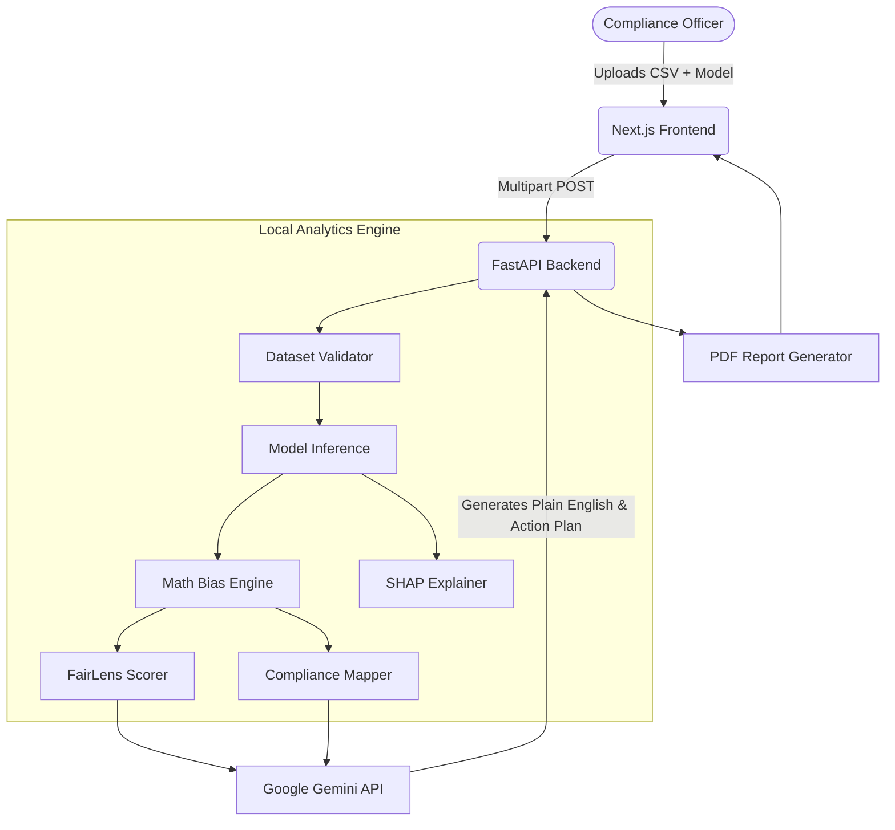

<div align="center">
  <h1>🔍 FairLens</h1>
  <p><strong>The compliance layer for Machine Learning models.</strong></p>
  <p>Every model that goes to production today is one bad prediction away from a lawsuit, a headline, and a regulator. FairLens catches discriminatory biases in 60 seconds.</p>
</div>

<br />

FairLens is an industry-grade ML auditing platform designed to detect bias, measure severity, and dynamically generate remediation action plans so your data science team can safely ship compliant models.

## 🌟 Key Features

* **Instant Bias Auditing**: Upload your dataset and model, and FairLens calculates Disparate Impact, Demographic Parity, Equalized Odds, and Calibration Difference instantly.
* **FairLens Score**: A unified 0-100 score summarizing the ethical posture of the model, easily understandable for non-technical leadership.
* **Regulatory Compliance Mapping**: Automatically maps failed mathematical metrics directly to legal frameworks such as the **EU AI Act**, **US EEOC 80% Rule**, and **ECOA**.
* **Individual Prediction Explainer**: Enter a single row of data to see exactly why a protected applicant was accepted/denied, leveraging SHAP waterfalls and automated counterfactual testing ("What if they were Male?").
* **Side-by-Side Model Comparison**: Compare a baseline model against a remediated model to prove quantifiable fairness improvements over time.
* **Conversational AI Analysis**: Powered by Google Gemini, the platform provides plain-english insight into the underlying causes of the bias and offers a 5-step concrete remediation plan.

---

## 🏗️ Architecture



---

## 🚀 How to Run Locally

You do not need an active Google Cloud Platform (GCP) project to test FairLens locally. Everything processes right on your machine!

### 1. Start the Backend (FastAPI)
```bash
cd backend
python -m venv venv
# Windows: venv\Scripts\activate
# Mac/Linux: source venv/bin/activate

# Install dependencies including dev testing tools
pip install -r requirements.txt
pip install -r requirements-dev.txt

# Start the API
uvicorn main:app --reload --port 8000
```
*The API is now running at `http://localhost:8000` with interactive docs at `/docs`.*

### 2. Start the Frontend (Next.js)
Open a new terminal tab:
```bash
cd frontend
npm install
npm run dev
```
*The Dashboard is now live at `http://localhost:3000`.*

---

## 🎭 Demo Instructions

FairLens comes pre-baked with three notorious ML bias scenarios. To experience a 60-second end-to-end demo:

1. Open `http://localhost:3000`.
2. Scroll to the **"Try a pre-trained scenario"** section on the landing page.
3. Click the **"COMPAS (Criminal Justice)"** button.
4. Watch the pipeline extract the dataset, compute the bias, and finalize the report.
5. In the results dashboard, explore:
   - The **FairLens Score**.
   - The **Compare Models** page (link at the top of history).
   - Try the **AI Follow-up Question** input.
   - Click **Export PDF Report** to view the regulatory compliance mapper output.

---

## 🔌 API Endpoints
Below are the primary non-ingestion API surfaces.

| Endpoint | Method | Description |
|---|---|---|
| `/api/v1/analyze` | `POST` | Kicks off the core bias analytics engine against uploaded configurations. |
| `/api/v1/history` | `GET` | Lists all historical audits sorted by completion date. |
| `/api/v1/results/{job_id}` | `GET` | Fetches the full JSON payload containing math metrics and model stats. |
| `/api/v1/explain` | `POST` | Triggers the Gemini analysis stream and SHAP PDF synthesis. |
| `/api/v1/explain/individual` | `POST` | Accepts a single JSON row, runs local Python inference, and returns SHAP/counterfactual insight. |
| `/api/v1/ask` | `POST` | Multiturn Q&A using Gemini contextualized strictly on the generated audit report. |

---

## 🧪 Local Test Suite

We use `pytest` to mathematically enforce the validity of our fairness engine (Disparate Impact constraints and Equalized odds parity).

```bash
cd backend
pytest tests/ -v
```

---
*Built for the 2026 AI Ethics Hackathon.*
